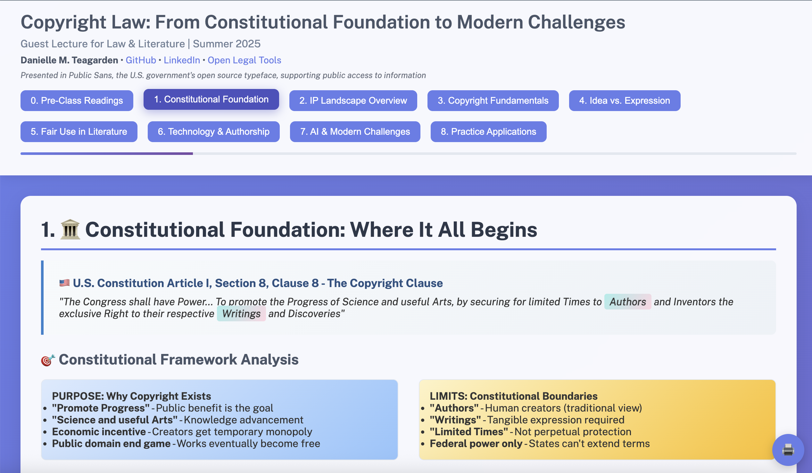

# Danielle Teagarden

<div align="center">
  
</div>

## About

I work at the intersection of **law and technology** with a human-first approach, building open tools that make the legal system more accessible and navigable for everyone. My focus is on creating technology that reduces friction in legal workflows, enabling legal professionals to focus on higher-level work while empowering the public to better understand and engage with the law.

All projects prioritize **accessibility** and follow open-source principles, building the right tools the right way—creating what ought to exist in the world.

**Speaking & Teaching:** Guest lectures on copyright law and legal technology, with a focus on making complex concepts accessible through interactive presentations.

**Core Focus:**
- 🛠️ **Open Legal Tools** - Building accessible technology for legal exploration and navigation
- ⚖️ **Workflow Optimization** - Reducing friction in legal processes through thoughtful technology
- 🌍 **Public Access** - Making legal knowledge and tools available to all
- 🎯 **Human-Centered Design** - Technology guided by equity and the Golden Rule

## Current Work

**🦸‍♀️ Code Batman Missions** - Swooping in to deliver quick, high-impact technical contributions to open source projects. Each mission is a discrete technical improvement that helps projects without long-term maintenance commitment. **[Track my missions →](https://codebatman.danielle.world)**

**Open Legal Tools** - Contributing to tools that democratize legal access and streamline professional workflows, making the law more transparent and navigable for practitioners and the public alike.

## 🦸‍♀️ Code Batman Missions

> **Philosophy:** Quick, high-impact technical contributions to open source projects. Like Batman swooping in to save Gotham, I identify specific technical challenges and deliver clean, well-tested solutions without requiring long-term maintenance commitment.

**🏆 Latest Missions:** 
- [Harvard Perma.cc - Bookmarklet URL Encoding Fix](https://github.com/harvard-lil/perma/pull/3727) - Fixed critical bug where URLs with special characters were truncated
- [Harvard H2O - Reading Mode Enhancement](https://github.com/harvard-lil/h2o/pull/2068) - Improved readability with optimal line length constraints
- [A11Y Project - Automated Link Checker](https://github.com/a11yproject/a11yproject.com/pull/1626) - Implemented monthly automated broken link checking
- [A11Y Project - Broken Link Fix](https://github.com/a11yproject/a11yproject.com/pull/1625) - Fixed broken internal link
- [Creative Commons License Chooser](https://github.com/creativecommons/chooser/pull/581) - Set up automated code formatting

[](https://codebatman.danielle.world)

**Mission Stats:**
- 🎯 **Total Contributions:** 5 across 3 organizations
- 🏢 **Organizations:** Harvard Library Innovation Lab, Creative Commons, The A11Y Project
- 💡 **Focus Areas:** Legal tech, accessibility, developer tooling, bug fixes
- 📊 **Status:** All PRs submitted and awaiting review

---

## Recent Projects

---

### 🎉 netlify-subdomain - My First NPM Package!

CLI tool that makes managing Netlify subdomains as simple as typing a command. No more clicking through the web UI!

[](https://www.npmjs.com/package/netlify-subdomain)
[](https://www.npmjs.com/package/netlify-subdomain)
[](https://github.com/danielle-teagarden/netlify-subdomain)
[](https://opensource.org/licenses/MIT)

```bash
npm install -g netlify-subdomain
netlify-subdomain add blog  # Creates blog.yourdomain.com instantly!
```

**Why I built this:**  
Needed to create subdomains frequently for various projects. The Netlify web UI requires multiple clicks and page loads. This tool reduces that to a single command.

**Features:**  
✔️ Add/remove subdomains from CLI  
✔️ Site aliases for quick access  
✔️ Works with any Netlify DNS-managed domain  
✔️ Zero configuration after initial setup

---

### Copyright Law Lecture

Interactive, accessible educational presentation exploring copyright law fundamentals—demonstrating how technology can make complex legal concepts more accessible and engaging.

[](https://copyright-law-lecture.netlify.app/)
[](https://github.com/danielle-teagarden/copyright-law-lecture)
[](https://creativecommons.org/licenses/by/4.0/)



**Who is this for?**  
Students, educators, legal professionals, and anyone interested in understanding copyright law fundamentals through an accessible, interactive format.

**Features:**  
✔️ Responsive design  
✔️ Keyboard navigation  
✔️ Mobile-friendly  
✔️ Interactive elements  
✔️ Accessibility-first

---

## Collaboration

I'm always interested in connecting with others working at the intersection of law and technology. Whether you're building legal tools, working on accessibility, or exploring how technology can serve justice - let's collaborate!

💡 **Open to:** Project collaboration • Feedback on legal tech tools • Speaking opportunities

## Tech Stack

**Frontend & Design:**  


**Development Tools:**  


**Backend & CLI:**  


**Deployment & Infrastructure:**  


## Connect

[](https://linkedin.com/in/teagarden)
[](https://github.com/open-legal-tools)

---

<div align="center">
  <i>Building what ought to exist</i>
</div>